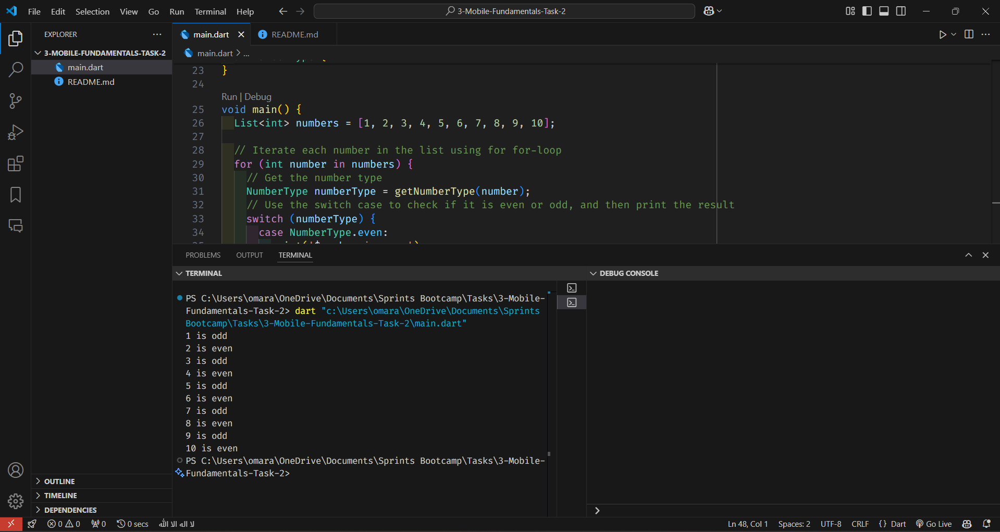

# Categorize Numbers as Even or Odd

This program categorizes a list of numbers into even or odd using for loop and switch case.

## Requirements

### Requirement 1

**Title:** Categorize Numbers as Even or Odd  
**Description:** The program should categorize a list of numbers into even or odd numbers, using a for loop and switch case.

## Code Explanation

```dart
/// Enum [NumberType] to categorize the number
enum NumberType {
  even,
  odd,
}

void main() {
  List<int> numbers = [1, 2, 3, 4, 5, 6, 7, 8, 9, 10];

  // Iterate each number in the list using for for-loop
  for (int number in numbers) {
    // Get the number type
    NumberType numberType = getNumberType(number);
    // Use the switch case to check if it is even or odd, and then print the result
    switch (numberType) {
      case NumberType.even:
        print('$number is even');
        break;
      case NumberType.odd:
        print('$number is odd');
        break;
    }
  }
}

/// Function [getNumberType] to determine if a number is even or odd
NumberType getNumberType(int number) {
  return number % 2 == 0 ? NumberType.even : NumberType.odd;
}
```

## Code Output

```
1 is odd
2 is even
3 is odd
4 is even
5 is odd
6 is even
7 is odd
8 is even
9 is odd
10 is even
```

## Code Output Screenshot



## How to Run

1. Copy the code into a Dart file.
2. Run the Dart file using a Dart compiler or an IDE that supports Dart.
3. The output will display the numbers categorized as even or odd.
